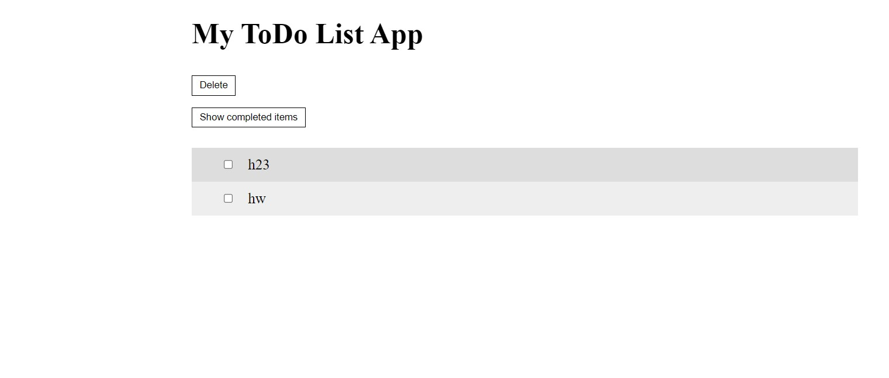

# Addition 1: Mark all as done button


# Addition 2: Show completed tasks page



# ToDo app
A simple todo app written in PHP and uses MySQL to store todo items.

This example illustrates creating a CRUD app (Create, Retreive, Update, and Delete) in PHP.

## Usage
You need to install mysql into your c9 workspace. Click on the bash terminal tab at the bottom of cloud9 IDE and type the following command:

`mysql-ctl install`

### Option 1: using the phpMyAdmin GUI tool
1. Install phpMyAdmin
`phpmyadmin-ctl install`
2. Copy the output URL and put it in a new tab and login into phpMyAdmin using your username with no password.
3. create a database named "todo_db" with the following table
4. create a table named "tasks" with the following fields:
```
+------------+--------------+------+-----+---------+----------------+
| Field      | Type         | Null | Key | Default | Extra          |
+------------+--------------+------+-----+---------+----------------+
| id         | mediumint(9) | NO   | PRI | NULL    | auto_increment |
| task       | varchar(255) | NO   |     | NULL    |                |
| date_added | datetime     | NO   |     | NULL    |                |
| done       | tinyint(1)   | NO   |     | 0       |                |
+------------+--------------+------+-----+---------+----------------+
```

### Option 2: using the command line interface (CLI)
1. From the Terminal, run the following commands:
` mysql -u yourC9Username -p `
Hit Enter for the password as there should be no password for your mysql database server
2. Run the following SQL commands:
```
CREATE DATABASE todo_db;
USE todo_db;
CREATE TABLE tasks(
    id MEDIUMINT NOT NULL AUTO_INCREMENT, 
    task VARCHAR(255) NOT NULL, 
    date_added DATETIME NOT NULL,
    done TINYINT(1) NOT NULL DEFAULT 0,
    PRIMARY KEY (id));
```

## Running the app
Once the database has been installed and the table has been created, simply run the project and visit the given URL.


